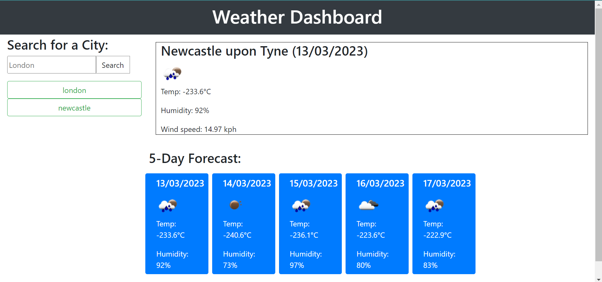

# weather-dashboard

## Description
I am creating an application that allows users to see the weather forecast for cities of their choosing.
Once a user types in the city of their choosing, a forecast will display on the dashboard consisting of 5 days, alongside a button that's been generated of their search - so that they can always click back and see their history.

## Screenshot

## Tools
- Open Weather Map API
- jQuery
- Moment.js
- HTML
- JavaScript
- Bootstrap
- CSS

## License
MIT.
